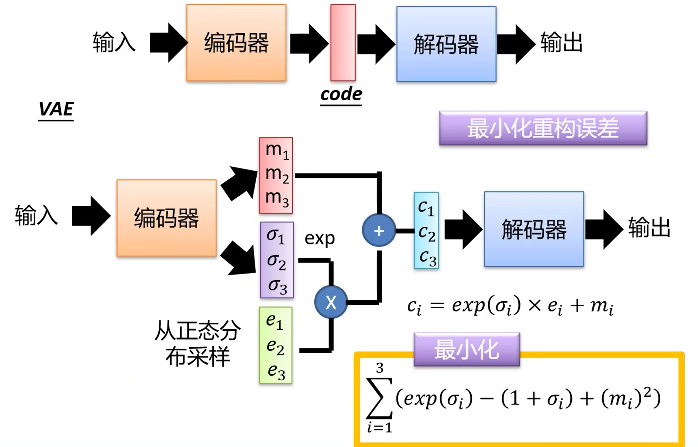
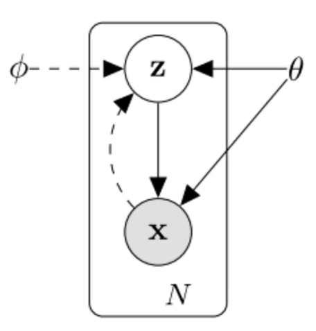

## Auto-Encoding Variational Bayes

#### Unsupervised learning

**生成模型**：给定训练集，产生与训练集同分布的样本。

$\text{Train data}\sim p_{data}(x),\text{Generating samples}\sim p_{model}(x)$

无监督学习里的一个核心的问题：**密度估计问题**

几种典型的思路：

- 显式的密度估计：显式的定义，并求解分布$p_{model}(x)$
- 隐式的密度估计：学习一个模型$p_{model}(x)$，而无需显式的定义它。

**VAE**：显式概率密度，但方程不可解，用近似方法。 

###### PixelRNN：

利用链式准则将图像$x$的生成概率转变为每个像素生成概率的乘积

**图像**$x$**的似然**：$p(x)=\prod\limits_{i=1}^np(x_i|x_1,\dots,x_{i-1})$，最大化训练数据的似然。

**需要定义像素的产生顺序。**

**这个分布很复杂，但是可以使用神经网络来建模。**

可以将像素生成看成一个序列生成的问题，利用**RNN**/**LSTM**的序列描述能力来生成新的像素。

**缺陷：序列生成，测试速度都非常慢。**

###### PixelCNN

基于已经生成的像素，利用**CNN**来生成新的像素。

可以只用卷积核涉及到的地方参与计算，会加快速度。**图像的产生过程还是逐像素的序列生成，所以仍然很慢。**

**PixelRNN和PixelCNN**:

- *优点*：
  - 似然函数可以精确的计算
  - 利用似然函数的值可以有效地评估模型的性能
- *缺点*：
  - 序列产生 $\Rightarrow$ 慢

##### （Variational Autoencoders）VAE

###### Auto-Encoding

**自编码器**：无监督的特征学习，其目标是利用无标签数据找到一个有效地低维的特征提取器。

</img>

$z$的维度一般小于$x$的维度（**特征降维**）**希望降维后的特征仅保留数据中有意义的信息。**

1. 早先方法：Linear + nonlinearity (sigmoid)
2. 卷积神经网络流行之前：Deep, fully-connected
3. 卷积神经网络流行后： ReLU CNN

**如何学习**：自编码利用重构损失（解码器）来训练低维的特征表示  

</img>

训练后移除解码器（decoder） 

已经训练完毕的编码器可以作为**有监督学习**的初始特征提取模型。

保留低维特征$z$，再去进行分类，对于提升网络性能有着极其好的作用。

利用少量有标签数据，训练最终的网络。

微调编码器的时候，编码器已经经过学习。

**但分类性能仍然不如有监督学习，因为生成式会重构特征，而不会去寻找最重要的分类特征**

###### Decoding

在降维后的码空间内随机采样一个编码，可以通过解码器来生成一个新的样本。

######  VAE

使用**VAE**的原因：传统编码器无法学习编码后的空间，也无法做出决策。因此使用变分自编码器。

- 生成$z$分布，并且从$z$分布中采样去进行生成。

</img>

编码器生成一个分布（均值/方差），并通过从正态分布采样输出特征。

*原始编码*：$m_1,m_2,m_3/\sigma_1,\sigma_2,\sigma_3$

*带噪声的编码*：$c_1,c_2,c_3$

一维：$z=m_1+\exp(\sigma_1)\cdot e_1$，从方差中采到一个偏移量。

*噪声的方差*（$\sigma_1,\sigma_2,\sigma_3$）是从数据中学习到的。

噪声取指数，保证其是个正数。

- 除重构损失外，需要最小化 $\sum\limits_{i=1}^{3}\left(\exp(\sigma_1)-(1+\sigma_i)+(m_i)^2\right)$
- **目的**: $\sigma\to0\hspace{1.0em}\hat{\sigma}=\exp(\sigma)\to1$，最后一项为$L_2$正则化，希望编码得到的码值不要过于集中，而是稀疏比较好。

###### 推导

*高斯混合模型*：$P(x)=\sum\limits_mP(m)P(x|m)$

**采样**：$m\sim P(m)$ 多项式分布，$m$为整数。

- 采到第$m$个高斯后，$x|m\sim\mathcal N(\mu^m,\Sigma^m)$

Each $x$ you generate is from a mixture.

Distributed representation is better than cluster.

*VAE*：$z\sim\mathcal N(0,I)$。 $z$的每一维表示一个属性，调整每一维的属性可以调整对应生成图片的属性。

**采样**：$x|z\sim\mathcal N(\mu(z),\sigma(z))$

将$z$输入到神经网络内，来学习$\mu(z)$和$\sigma(z)$

 变分自编码器采样：$P(x)=\int\limits_zP(z)P(x|z)dz$

**虽然$z$采样自$\mathcal N(0,1)$，但是$P(x)$可以具有很复杂的形式。**

**极大似然估计**
$P(z)$正态分布，$x|z\sim\mathcal N(\mu(z),\sigma(z))$，其中$\mu(z)$和$\sigma(z)$为待估计的参数。

$P(x)=\int\limits_zP(z)P(x|z)dz$，不同的$z$码对应不同的高斯。

$L=\sum\limits_{x}\log P(x)$

**VAE为近似方法的原因**：由于有隐变量$z$，无法最大化似然，无法通过穷举所有的$z$进行积分，$p(x|z)$**无法写出来，而是通过神经网络学习得到的**

但并不是所有的$z$都能产生高斯到图像，所以我们只考虑数据可以产生的$z$，利用数据产生的$z$进行学习。

我们需要另一个分布$q(z|x)$：$z|x\sim\mathcal N(\mu'(x),\sigma'(x))$.

通过编码器得到$\mu'(x),\sigma'(x)$，通过解码器得到$\mu(z),\sigma(z)$

**考虑**：$\log P(x)=\int\limits_zq(z|x)\log P(x)dz$

- 恒等式引入$q(z|x)$，等式本身与$\log p(x)$无关，而$\int\limits_zq(z|x)dz=1$，此时的$q(z|x)$可以是任何分布

**推导**：
$$
\begin{aligned}
	\log P(x)&=\int\limits_zq(z|x)\log P(x)dz\\
	&=\int\limits_zq(z|x)\log\left(\frac{P(z,x)}{P(z|x)}\right)dz&\text{贝叶斯公式}\\
	&=\int\limits_zq(z|x)\log\left(\frac{p(z,x)q(z|x)}{q(z|x)p(z|x)}\right)&\log\text{公式内引入}q(z|x)\\
	&=\int\limits_zq(z|x)\log\left(\frac{p(z,x)}{q(z|x)}\right)dz+\int\limits_{z}q(z|x)\log\left(\frac{q(z|x)}{p(z|x)}\right)dz&分解\\
	&=\int\limits_zq(z|x)\log\left(\frac{p(z,x)}{q(z|x)}\right)dz+KL(q(z|x)||p(z|x))\\
	&第二项KL散度一定是大于0的，衡量两个分布之间的距离，但是由于无监督，本项并不参与计算\\
	&\geq\int\limits_zq(z|x)\log\left(\frac{p(x|z)p(z)}{q(z|x)}\right)dz
\end{aligned}
$$
其中，$q(z|x)\log\left(\frac{p(x|z)p(z)}{q(z|x)}\right)$是$\log p(x)$的下界函数$L_b$，因此优化此项，也是优化最大似然。 
$$
\begin{aligned}
L_b&=\int\limits_zq(z|x)\log\left(\frac{P(z,x)}{q(z|x)}\right)\\
&=\int\limits_zq(z|x)\log\left(\frac{p(x|z)p(z)}{q(z|x)}\right)&分解\\
&=\int\limits_zq(z|x)\log\left(\frac{p(z)}{q(z|x)}\right)+\int\limits_zq(z|x)\log p(x|z)dz\\
&=-KL(q(z|x)||p(z))+\int\limits_zq(z|x)\log P(x|z)dz
\end{aligned}
$$
**与神经网络之间的联系**：

分解$L_b=A_1+A_2$:

1. 最小化 
   $$
   A_1=KL(q(z|x)||p(z))
   $$
   等价于最小化
   $$
   \sum\limits_{i=1}^3\left(\exp(\sigma_i)-(1+\sigma_i)+(m_i)^2\right)
   $$
   
2. 最大化(离散的$z$下，取得$x$的期望)
   $$
   A_2=\int\limits_zq(z|x)\log P(x|z)dz=E_{q(z|x)}[\log P(x|z)]
   $$

3. 

</img>

###### 总结

基于典型自编码器拓展成的概率框架$\Rightarrow$可以产生新的样本

定义一个难以计算的密度函数$\Rightarrow$通过推导来优化一个下边界

**优点**：

- 作为生成模型里的一种典型的方法
- 可以计算$q(z|x)$，这个特征表示可以用在其他的许多任务中。

**缺点**：

- 最大化似然函数的下边界能够有效地工作，但是模型本身并不像PixelRNN或者PixelCNN那样好评估。
- 与最新的技术(GANs)相比，产生的样本较模糊，质量较低。

### Intuition

(High dimensional) **variable** $x$: generated from conditional distribution $p_{\theta^*}(x|z)$

**Unobserved continuous random variable** $z$: generated from prior distribution $p_{\theta^*}(z)$

# 假设$z$是满足一定分布的，那么也会有从参数$\theta$到$z$的箭头。星号$\theta^*$代表Groundtruth，之后提到的$\theta$均为Decoder的参数。$\phi$为Encoder的参数

**Intractability**:

-  $p_\theta(z|x)=p_\theta(x|z)p_\theta(z)/p_\theta(x)$

- $p_\theta(x)=\int\limits_zp_\theta(z)p_\theta(x|z)dz$

**Approximation:**

- $p_\theta(z|x)\overset{\sim}{=}q_\phi(z|x)$ # 推导已经写在前面的部分上了

$\log(p_\theta(x))=KL(q_\phi(z|x)||p_\theta(z|x))+L(\theta,\phi;x)$ 	**non-negative + Variation Lower Bound**

**Maximize the lower bound**：

$L(\theta,\phi;x)=E_{q_{\phi}(z|x)}[\log(p_\theta(x|z))]-D_{KL}(q_\phi(z|x)||p_\theta(z))$	**Reconstruction Loss + Regularization Loss**

# 前一项希望从$z$推导出的$x$和我们实际的$x$尽量接近，第二项希望两个分布尽量接近

**Gradient Estimation**: Naive Monte Carlo gradient estimator.有着方差比较大的导数。

**Generic Stochastic Gradient Variational Bayes (SGVB) estimator**

KL散度部分的Loss：
$$
-\frac{1}{2}\sum\limits_{j=1}^J\left(1+\log((\sigma_j)^2)-(\mu_j)^2-(\sigma_j)^2\right)
$$
期望部分的Loss:
$$
f^*=\arg\max\limits_{f\in F}\mathbb{E}_{z\sim{q_x^*}}\left(-\frac{||x-f(z)||^2}{2c}\right)\hspace{2.0em} \text{MSE}
$$
</img>

## VQ-VAE: Neural Discrete Representing Learning

VQ-VAE编码得到的编码向量是离散化的，**编码向量的每个元素都是一个整数。** Quantised(量子化)

**PixelCNN**：

$p(x)=p(x_1)p(x_2|x_1)\dots p(x_{3n^2}|x_1,x_2\dots,x_{3n^2-1})$，其中每一个概率都是一个$256$分类问题

**自回归模型**：如何设计递归顺序/如何加速采样过程。

但生成像素仍然很耗时，序列很长，不管是RNN还是CNN都无法很好的捕捉长依赖。

且原始的自回归割裂了类别之间的联系，因为连续像素之间的差别是很小的，如果使用交叉熵来预测会带来很大的损失（像素值$100$或是$99$本质上的区别并不大）

**VQ-VAE：先降维，再对编码向量使用PixelCNN建模**

**问题**：

- 常见的降维手段，如自编码器，生成的编码都是连续性变量，无法直接生成离散的变量。
- 同时，生成离散型变量还意味着存在梯度消失的问题。
- 且降维，重构要保证重构之后的图像不失真。

###### 最邻近重构

图片$x\in\R^{n\times n\times 3}$被传入$\text{encoder}$中，得到连续的编码向量$z$
$$
z=\text{encoder}(x),z\in\R^d
$$
同时，VQ-VAE维护一个$\text{Embedding}$层，也可以成为编码表，记为
$$
E=[e_1,e_2\dots,e_K],e_i\in\R^d
$$
随后，通过最邻近搜索，将$z$映射为这$K$个向量之一。
$$
z\rightarrow e_k,\hspace{2.0em}k=\arg\min\limits_j||z-e_j||_2
$$
将$z$对应的编码表向量记作$z_q$，最后传入一个$\text{decoder}$，希望重构原图$\hat{x}=\text{decoder}(z_q)$

由于$z_q$是编码表$E$中的向量之一，所以它实际等价于$1,2,\dots,K$这$K$个整数之一。因为整个流程相当于把图片编码为了一个整数

但若只编码为一个向量，重构的时候可能会失真，泛化性难以得到保障，因此实际编码的时候使用多层卷积，将$x$编码为$m\times m$个大小为$d$的向量。
$$
z=\left(
	\begin{array}{cccc}
		z_{11}&z_{12}&\dots&z_{1m}\\
		z_{21}&z_{22}&\dots&z_{2m}\\
		\vdots&\vdots&\ddots&\vdots\\
		z_{m1}&z_{m2}&\dots&z_{mm}
	\end{array}
\right),z\in\R^{m\times m\times d}
$$
此时，在保留原来位置结构的基础上，每个向量都用前述方法映射为编码表中的一个，可以得到一个同样的大小的$z_q$，并且进一步用它来重构。

$z_q\in\R^{m\times m}$

###### 自行设计梯度（Straight-Through Estimator）

普通自编码器的训练Loss: $||x-\text{decoder}(z)||_2^2$

VQ-VAE: $||x-\text{decoder}(z_q)||_2^2$

**问题**：$z_q$的建构过程中包含了$\arg\min$，这个操作没有梯度，无法反向更新$\text{encoder}$

**Straight-Through Estimator**：

前向传播的时候可以用想要的变量（哪怕不可导），反向传播的时候利用设计好的梯度

因此，目标函数：$||x-\text{decoder}(z+sg[z_q-z])||_2^2$

反向传播的时候根据$\text{decoder}(z)$来反向传播

###### 维护编码表

期望$z_q$与$z$本身很接近，因此将$||z-z_q||_2^2$添加到损失中
$$
||x-\text{decoder}(z+sg[z_q-z]||_2^2+\beta||z-z_q||_2^2
$$
更进一步，应该让$z_q$靠近$z$而不是$z$靠近$z_q$，因为$z$要保证重构的效果，因此，将上式等价分解为
$$
||sg[z]-z_q||_2^2+||z-sg[z_q]||_2^2
$$
并可以分别调整这两项的比例，其中$\gamma<\beta$，原文中$\gamma=0.25\beta$
$$
||x-\text{decoder}(z+sg[z_q-z])||_2^2+\beta||sg[z]-z_q||_2^2+\gamma||z-sg[z_q]||_2^2
$$

###### 拟合编码分布

将图片编码为$m\times m$的整数矩阵后，其一定程度上保留了原来输入的图片的位置信息，可以使用自回归模型来对其进行拟合。得到编码分布，可以随机生成一个新的编码矩阵，然后通过编码表$E$来映射为$3$维的实数矩阵$z_q$（行\*列\*编码的宽度），最终通过$\text{decoder}$得到一张图片

### MotionGPT: Human Motion as a Foreign Language

###### Introduction

前作通常将动作和语言视作分开的模态，这会导致训练需要严格绑定的动作和文本数据。

且监督为任务驱动，很难泛化到没有涉及到的任务或数据，因为模型缺乏一种对语言和动作之间具体理解。

于是本文聚焦于建立一种**可以泛化到多种任务**并且可以**从更可行的动作和语言数据来深入学习动作语言关系**的预训练大语言模型，

主要有两个挑战

1. 建模语言和动作之间的关系。
2. 建立一个统一的多任务框架，可以推广到新的任务上。

基于视觉语言预训练BEIT-3来将人类动作视作一门外语。

将动作和语言数据结合在一起，并且使用单一的词汇来编码，可以使动作和语言的关系显得更透明。

动作-语言预训练在提高动作任务上的表现有着很大的潜力。同时，预训练允许用户使用自然语言化的指令，（提示词Prompt）。可以使模型变得更多元化，以及对用户更友好。

本篇提出一个统一的动作-语言框架，即MotionGPT，可以利用预训练大语言模型的强**语言生成能力**和**零样本学习能力**来完成和人类动作相关的任务。

为了使MotionGPT拥有能够理解并产生人类动作的能力，首先学习了一个基于动作的VQ-VAE模型，目的是建立动作词典，类似于英语词典可以将raw的动作数据转化为一系列的动作信号(motion tokens)。

这些记号会随后被预训练大预言模型处理，会学习动作语言潜在的语法和句法以及与对应语言描述之间的关系。

为了更高效的融合动作和语言，我们设计一个两步骤的训练。

1. 在raw motion数据集上序列来学习motion language最基本的语法、句法。
2. 对于提示词的调试，我们在指令数据集上fine-tune了语言模型。

扩展的一些试验展示了MotionGPT可以在text-to-motion，motion-to-text，motion prediction和motion in-between上达到state-of-the-art的表现。

###### Related Work

**Human Motion Synthesis**

使用多模态数据，生成广泛真实的类-人类的动作。模态：文本、动作和不完全的动作。

Text-to-motion使最重要的动作生成的任务之一，为了用户友好和方便的语言输入。

**MDM**提出了基于扩散的生成模型，在多种动作任务上分别训练。

**MLD**进一步使用隐扩散模型，来基于不同的条件输入来生成动作。

**T2M-GPT**研究了基于VQ-VAE和大预言模型的生成式框架进行的动作生成。

动作完成任务会根据部分动作进行动作的生成，比如传统的动作预测或者中间动作生成。

尽管在多种人类动作任务上已经表现出了不错的结果，以上的方法被限制在使用一个单一的模型来处理多种任务。

**Human Motion Captioning**

为了用自然语言去描述人类的动作，学习从人类动作到语言的映射，主要用到两个统计学模型。

**TM2T**提出了一种新的动作表示，将动作压缩为一个短的离散变量的序列，随后用一个神经网络来将这两个模态之间建立映射。

这些工作的局限是，使用单一的框架来进行双向翻译的工作。

**Language Models and Multi-Modal**（LLMs）

大语言模型，拥有很强的理解力和泛化力，善于处理自然语言。

**BERT**预训练深度双向的语言表示，可以有效的支持下游任务。

**T5**介绍了一个统一的框架，可以将基于文本的语言问题转化为text-to-text的格式。

更多最新的调查显示，使用input-output成对的指令和配套的答案的输入对来训练，可以更好的提升预训练模型的表现。

**FLAN**展示了指令微调的技术，在训练未涉及到的任务上的表现高于没有微调过的模型。

**CLIP**学习了语义潜在的表示，可以配套的将文本和对应的语言描述相结合。

尽管上述的语言模型很成功，但对于能处理人类动作的能力来说还是十分有限。

**Motion Language Pre-training**

现存的text-to-motion方法基本都是接受纯文本输入。尽管这些模型能够从文本描述中生成动作，如**InstructGPT**这也仅仅被限制在支持用户的指令。

换句话说，它们不允许用户为特定的应用提供特定于上下文的指令。MotionGPT利用**CLIP**的语言和视觉理解将其潜在空间与运动自编码器对齐。

同时，更多的语言模型，像是**T5**和**InstructGPT**，已经被发展为解决多样的语言任务，并没有能够泛化到解决动作的任务。因此，我们提出MotionGPT来有效的解决自然语言模型和人类动作任务的融合，为动作合成的问题提供一致的解。

##### Method

MotionGPT由一个负责**将raw motion data转化为离散motion tokens**的motion分词器，以及一个**能够理解 用对应的文本描述和预训练大语言模型产生的motion tokens**的 感知动作的语言模型。

为了能够处理任务相关的任务，提出三阶段的训练，分别是

1. Training of motion tokenizer.
2. Motion-language pre-training.
3. Instruction tuning

我们首先提出motion tokenizer由一个motion encoder $\mathcal\varepsilon$ 和一个motion decoder $\mathcal D$ 组成，将一个$M$帧长度的动作$m^{1:m}=\{x^i\}_{i=1}^M$ 编码为$L$个motion tokens，$z^{1:L}=\{z^i\}_{i=1}^L,L=M/l$. 解码$z^{1:l}$ 会重新得到动作 $\hat{m}^{1:m}=\mathcal D(z^{1:L})=D(\mathcal\varepsilon(m^{1:m}))$

- $l$ 是动作长度的降采样率

随后给定一个$N$长度的序列$w^{1:N}=\{w^i\}_{i=1}^N$描述一个动作相关的问题或者要求，MotionGPT针对此去生成它的答案为长度为$L$的tokens $\hat{x}^{1:L}=\{\hat{x}^i\}_{i=1}^L$. 这可以是人类human motion tokens $\hat{x}_m^{1:L}$或者是文本记号 $\hat{x}_t^{1:L}$, 最后会输出一个动作 $\hat{m}^{1:M}$或者一段序列$\hat{w}^{1:L}$来描述给定的动作。

###### 3.1 Motion Tokenizer

为了用离散的tokens来表达动作，我们基于VQ-VAE方法预训练了一个3D人类动作的tokenizer $\mathcal V$。我们的motion tokenizer由一个编码器 $\mathcal\varepsilon$ 和一个解码器 $\mathcal D$ 组成。编码器产生离散的motion tokens，携带极高的信息密度，解码器有能力去将motion tokens解码为动作序列$\hat{m}^{1:M}$. 这个方法允许我们高效的将动作表示为一种语言，促进动作和自然语言在不同的动作相关的任务上的融合。

具体来说，motion encoder $\mathcal\varepsilon$ 先应用 $1D$ 卷积在时间维度上，来给出逐帧的动作特征 $m^{1:M}$。接下来得到隐变量向量$\hat{z}^{1:L}=\mathcal\varepsilon(m^{1:M})$. 随后，将 $\hat{z}$ 通过离散量化来转换为codebook元素 $z$ 的集合。

可学习的codebook $Z=\{z_i\}_{i=1}^K\subset R^d$, 由$K$个隐的嵌入式向量组成，每一个都是$d$维。量化的过程$Q(\cdot)$将原始的行向量$b$替换为$Z$中的元素$b_k$，写作
$$
z_i=Q(\hat{z}^i):=\arg\min\limits_{z_k\in Z}||\hat{z}_i-z_k||_2
$$
在量化之后，motion decoder $\mathcal D$ 将 $z^{1:L}=\{z^i\}_{i=1}^L$重新投影回原始的动作空间 $\hat{m}^{1:M}$，生成$M$帧的动作。

为了训练这个动作的tokenizer，我们利用了三个不同的损失函数来训练并优化motion tokenizer: $\mathcal L_{\mathcal V}=\mathcal L_r+\mathcal L_e+\mathcal L_c$

1. $\mathcal L_r$: Reconstruction loss.
2. $\mathcal L_e$: Embedding loss.
3. $\mathcal L_r$: Commitment loss.

为了更好的提升生成动作的质量，我们利用$L_1$ smooth loss 和 velocity regularization在$\mathcal L_r$中，同样还有 exponential moving average (EMA) 和 codebook reset techniques 来提升训练时codebook的效用。在补充材料处，提供了更多架构的细节。

###### 3.2 Motion-aware Language Model

部署motion tokenizer后，可以得到一个$m^{1:M}\mapsto z^{1:L}$，也允许了在语言模型中嵌入类似的联合表示。将他们结合在统一的字典中后，开始分开学习动作和语言。

首先先将motion tokens $z^{1:L}$ 表示为一个索引的序列 $s^{1:L}=\{s^i\}_{i=1}^L$, $s^i$ 对应了motion tokens $z^{1:L}$ 的索引。另一方面，过去的语言模型，类似 T5, 将文本编码为 WordPiece tokens. 他们利用一个有着$K_t$个word pieces长度的词汇表，并且训练在混合语言的数据集上训练 SentencePiece model。

大部分过去的 text-to-motion 或者 motion-to-text 的方法，部署了不同的模块来分开处理动作和语言，但我们针对性的同时建模语言和文本。为了达到这个目标，我们将原始的文本词汇$V_t=\{v_t^i\}_{i=1}^{K_t}$和动作词汇$V_m=\{v_m^i\}_{i=1}^{K_m}$结合在一起，也保留了在我们的motion codebook $Z$ 中出现的顺序。

其次，$V_m$包括了一些特殊的记号像是boundary indicators，例如`</som>`和`</eom>`作为**start of motion**和**end of motion**.

因此，我们部署了一套全新的统一的text-motion词汇表$V=\{V_t,V_m\}$并且可以在一个更广泛的格式上形成更多样的动作相关的任务，因为输入的"words"和输出的"words"是从相同的$V$中得到的。

这些”words“可以表示更加自然的语言，人类动作，甚至是两者的融合，这视具体需要解决的任务来定。

因此，我们的MotionGPT允许我们在一个单模型中拥有更灵活的表达和生成模式。

为了解决条件生成任务，我们部署了一个基于Transformer的模型，可以有效的将输入的序列映射到输出上。我们的源输入由一个tokens的序列组成，$X_s=\{x_s^i\}_{i=1}^N$，$x_s\in V$以及$N$表示输入长度。

相似的，目标输出为$X_t=\{x_t^i\}_{i=1}^L$, $x_t\in V$且$L$表示输出长度。

源tokens会被喂进tranformer encoder中，并且后续的decoder会在每一步中，在自回归的模式下，预测下一个token的概率分布。
$$
p_\theta(x_t|x_s)=\prod_ip_\theta(x_t^i|x_t^{<i},x_s)
$$
优化这一目标，MotionGPT学会去抓住数据分布下潜在的模式和关系，强化了生成目标”words“的准确性和意义性。

在推理过程中，目标记号被从预测分布$p_\theta(\hat{x}_t^i|\hat{x}_t^{<i},x_s)$中递归采样，直到结束符号`</s>`出现。

这种采样策略使得目标序列的生成是一种步进式的行为，每一个记号都是由源输入和之前的记号概率性决定的。

###### 3.3 Training strategy

因为T5s仅仅被暴露在语言数据下，被语言词汇表$V_t$所表示，我们将动作和语言的结合可以让这个模型来理解人类动作的概念，通过学习动作词汇$V_m$。

我们的训练主要分为三步

1. Training of motion tokenizer：聚焦于学习motion codebook来将人类的动作表达为离散的tokens。
2. Motion-language pre-training stage：包含了非监督和监督的目标来学习动作语言之间的关系。
3. Instruction tuning stage：基于有提示词的指令来微调模型针对各种不同的动作任务。

**Training of motion tokenizer**: 

优化后，motion tokenizer在后续的pipeline中维持不变。

**Motion-language Pre-training Stage**:

T5模型在自然语言数据集上被训练和微调，基于指令。

我们接下来会使用语言和动作数据的混合来继续预训练模型，同时使用有监督和无监督的行为。

1. 为了泛化到不同的下游任务，我们设计了一个目标，在输入tokens $X_s$中的$15\%$的tokens会被随机的替换为sentinel token. 同时，对应的目标序列也被提取出dropped-out的tokens，被输入tokens序列的相同的sentinel token替换掉，同时会有一个额外的sentinel token来表示序列的结束。
2. 随后，我们学习motion-language之间的关系，通过text-motion数据集的监督。我们用motion-language的监督任务来训练MotionGPT，输入是一个人类动作或文字输入。

在非监督和监督的训练过程结束后，我们的模型会等同于具有了理解语言和动作之间关系的能力。

**Insturction Tuning Stage**

我们建立了一个多任务的text-motion数据集，通过将已有的类似HumanML3D和KIT等已经存在的text-to-motion数据集制定为指令。

特殊的，我们定义了$15$种核心的任务，类似文字生成动作，动作捕捉，动作预测以及其他的一些任务。

对于每个人物，我们将大量不同的指令模板结合起来，产生了多于$1000$种不同的任务，每个都有一种独特的命令提示词。

例如，一个动作生成任务的Instruction prompt可以是

”Can you generate a motion sequence that depicts ‘a person emulates the motions of a waltz dance’?” 

同样，动作捕捉的任务，提示词可能是

"Provide an accurate caption describing the motion of <motion_tokens>", `<motion_tokens>`代表了一个motion tokens的序列，由motion tokenizer生成。

指令微调促进了跨任务的表现，并增强了未见任务或提示的模型性能。

### PoseFix: Correcting 3D Human Poses with Natural Language

###### Introduction

本篇论文，我们聚焦自由格式的反馈，描述两个静态的3D人物姿势之间的变化（可以从实际的姿势序列中提取）。

静态的原因是因为存在很多需要对静态身体姿势的细粒度变化进行语义理解的设置。

- 例：瑜伽极具挑战性和特殊性 (有很多微妙的变化)，而且是静态的。

有些运动需要每一刻的姿势都近乎完美: 

- 可能为了更好的效率，以避免任何疼痛或伤害
- 或者只是为了更好地呈现，如古典舞，瑜伽，空手道等。

更重要的是，复杂动作的实现有时需要精确的一步一步的指导，以便于学习这种动作或正确地执行它。

自然语言在这种情景下有着很大的帮助，因为自然语言**高度语义化**和**无限制的**，是一种很直觉的方式去传递想法。

3D姿势可以在设置框架内手动编辑。若是直接面对面上手操作去修改非专业运动员的动作是一件不太可能的事情的话，那么语言是极其**有效率的**。

我们提出的姿势语义也可以用于其他模态（图片）或者其他设置（机器人教学）之中。

虽然语言和图像之间的联系已经在自动图像描述、图像编辑等任务中得到了广泛的研究，但利用自然语言进行三维人体建模的研究仍处于起步阶段。

少数作品使用文本描述来生成运动，来描述合成2D渲染图的姿势差异，或描述单个静态姿势。

总之目前没有数据集可以将 3D姿态成对的，从一个姿势转移姿势，和自然语言相互结合。 因此，在这项工作中，我们引入了**PoseFix**数据集，其中包含超过

人类注释员为此场景编写的$6000$个文本的修改指导。

另外，也引入了一种pipeline，可以自动的生成文本的修改并且增加数据的大小。

利用PoseFix数据集，我们解决两个任务。

1. *基于文本的动作修改* ：目的是从初始的姿势和修改指令，生成更多的姿势。
2. *修正的文本生成*：目标是产生一组动作之间的差别的文本描述。

对于第一个任务：baseline采用条件VAE (cVAE).

对于第二个任务：考虑baseline从一个自回归transformer模型中产生。

对于两个任务都有一个明确的评估函数。

**总结**：

- PoseFix数据集：不同成对3D的人类姿势和人类书写的文本来描述他们之间的区别。
- 基于文本的动作修改：可以被cVAE baseline解决。
- 用自回归模型学习纠正性文本的生成。

##### The PoseFix dataset

为了解决上述poseFix提到的两个修正任务，我们引入了**PoseFix**数据集。

数据集由 $135k$ 个三元对组成，格式为$\{pose~A,pose~B,text~modifier\}$

- $pose~B$ (目标动作) 是 $pose~A$（源动作） 修正的结果，具体修正的过程由 $text~modifier$ 指定。

$\text{3D}$人类姿态动作从AMASS中采样。所有的三元对都有自然语言说明。

另外 $6157$ 对额外的呈现给人类标注员，接下来会给出一些对动作对的比较方法，标注过程和一些数据统计。

###### 3.1 Pair Selection process

*In- and Out-of-sequence pairs*

姿势对可以有两种类型，在序列中（in-sequence，IS）或者不在序列中（out-of-sequence，OOS）

- 第一种情况下，两个姿势属于相同的AMASS序列，并且时间有序（A动作发生在B动作之前）。我们以0.5秒的最大时间差选择它们，同时附加能精确描述原子动作子序列和真实动作的文本修改意见。
  - 若是时间间隔再增大的话，有可能他们中间有无数个合理的中间动作，就会削弱这种监督信号。
- 第二种情况下，两个从不同的序列中选取，使得结果更能向不普遍的动作去泛化。可以帮助学习相同的配置下不同模式的姿态矫正。

*Selecting pose B*

我们目标是从姿态$A$中得到姿态$B$，我们认为姿态$B$主导了标注过程，文本修正描述应该从$A$出发最后落实到$B$上。

因此，为了建立这种三元组，我们先选择了一组 $pose~B$ 的集合，为了使姿势最大化的多元化，我们用最远点算法得到了由 $100k$ 姿势组成的集合$S$.

接下来从集合$S$中迭代的选择 $pose~B$.

*Selecting pose A*

配对的姿势应该主要满足两个主要的约束条件。

1. 首先、必须得足够相似，这样文本修饰不会成为只是对$B$动作的描述。如果$A$和$B$动作过于不同，注视者很容易的就会忽略$A$而是直接标注$B$。然而，我们的目标是学习差异，因此我们根据每个姿势之间的**余弦相似度**来对$S$中的所有姿势进行排序。姿势$A$从前$100$名中选出。
2. 其次、两个姿势必须由足够的差异性，这样标注的修改不会变得仅像“Raise your right hand.” 这样过于简单的指示，这样和真实的情况是没有可对照性的。我们又期待姿势有差异性，但他们也要同时属于$S$集合，我们接下来利用了PoseCode的信息来保证两个姿势有至少分别有$15,20$的低水平差异对于IS，和OS的三元对。

*One- and Two-way pairs*

我们考虑到所有可能的IS对，$A\to B$, $A$和$B$均在集合$S$中，且这样的配对都是满足于我们上述的选择限制的。

接下来，由$S$定义对的顺序，我们选择OOS对，对于$A\to B$，如果$A$还没有被另一对用过的话，我们也考虑$B\to A$。

我们称这种对为“双向配对“(two-way pairs)，和”单向配对“(one-way pair) 相对。双向配对可以确保循环的一致性。

*Splits*

基于序列分割，每个子集独立执行姿势对选择。由于我们也使用了相同的有序集合$S$，一些姿势被标注了描述和修饰符。这样的补充信息可以在多任务的设置中使用。

###### 3.2 Collection of human annotations

不太关心，总之就是论文会说自己数据的选取是高标准，严要求的。

###### 3.3 Generating annotations automatically

为了能够扩大数据集，我们设计了一套管线，可以自动的生成数千的修改文本，依赖于前文提到的低level特性。

生成将姿势$A$, $B$的3D节点位姿读入，然后输出一个从姿势B到姿势A的文本描述。

最开始，先测量原子位姿构型的变化，去得到一组”对码“。举例来说，我们关注每个轴上关键点的动作

- ==Move the right hand slightly to the left== 将右手轻轻的挪到左侧 ($x$-axis)
- ==Lift the left knee== 提起左膝 ($y$-axis)

也关注两个关节点之间的变换

- ==Move your hands closer== 将你的两只手挪的更近一点

还有角度的变换

- ==Bend your left elbow== 弯曲你的左手肘

我们进一步定义了”超级对码“，它是由多个对码或姿态码组成的。

例如：

- paricode ==bend the left knee less== 和posecode ==the left knee is slightly bent==是相互关联的，作用在$pose~A$上就会变成超级对码==straighten the left leg==
- 超级对码使得我们有可能去描述更高阶的概念或者精炼某些评测（比如最开始两手靠的很近的话，就告诉它们要远离彼此）

接下来，用相同的规则对对码进行聚合，结构性排序，在描述中收集有关身体一般部位的信息。

最后，对于每一组对码，我们采样并且用一个模板类的句子来将它们关联。它们的连接就产生了自动修饰符。

注：本文只用自动生成的数据进行了预训练。

###### 3.4 Statics and semantic analysis

一些数据统计，不记了。

准备开始部署项目
